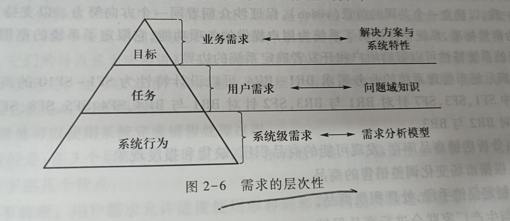
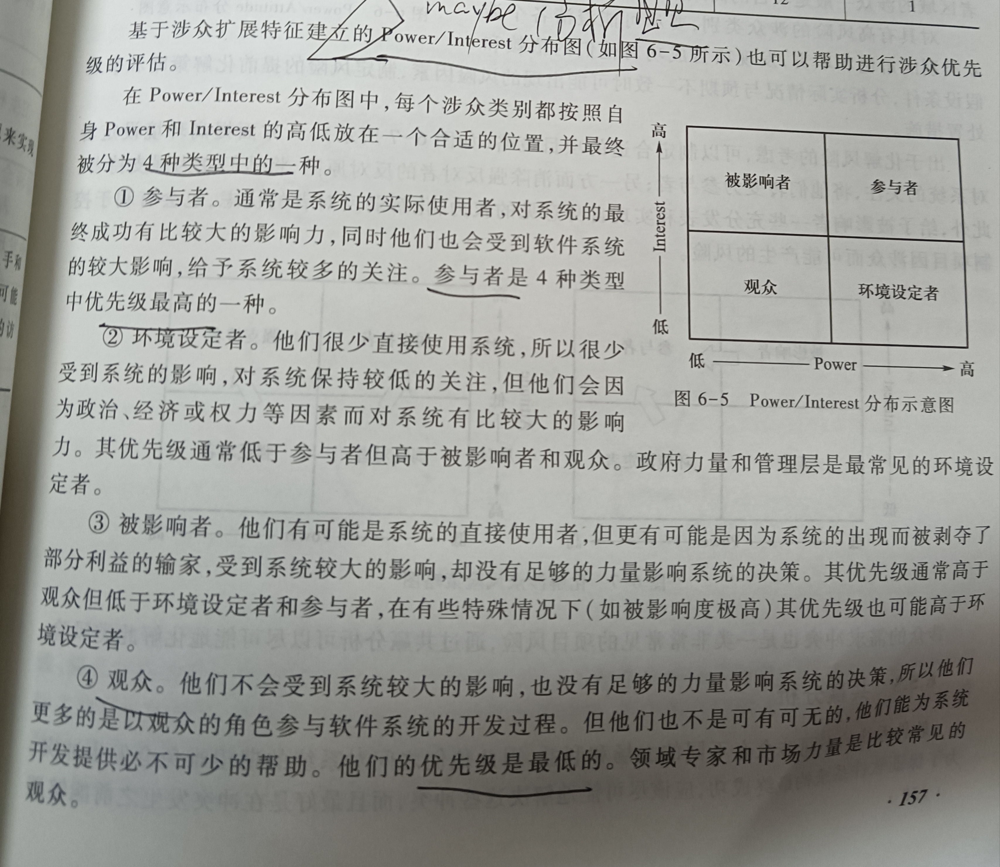

## 第一章 导论
* **软件的“模拟性”**：
  * 目的性，软件的目的性是直接或间接满足用户的某些目的或解决问题
  * 正确性：软件具备的功能能保证目的的正确实现
  * 现实可理解性：软件实现功能的基础手段过程是在用户领域内现实可理解的
* **常识类**：
   * 需求处理是软件工程的起始阶段，若此阶段出现错误，则维护阶段需要付出**高代价**
   * 需求工程师需要创新
   * 需求获取和需求分析是交织在一起的

## 第二章 基础
* 需求工程活动包括**需求开发**和**需求管理**
  * 需求开发包括
    * 需求获取：目的是从项目的战略规划开始建立最初的原始需求
    * 需求分析：保证需求的完整性和一致性  <u>**？？？有疑问**</u>
    * 需求规格说明：将完整、一致的需求与能满足需求的软件行为以文档方式明确固定
    * 需求验证：保证需求及文档的正确性及完整性、一致性 ？？？有疑问
  * 需求管理是因为需求工程的“工程”特性而存在的，目的是在需求开发活动后保证确定的需求能在后续项目活动中有效发挥作用
* 需求和问题都有层次性
  * 需求常见的抽象层次有3层：①**业务需求**：针对整个业务（**层次最高，系统建立的战略出发点，描述了为什么要开发系统**  ②**用户需求**：针对具体任务  ③**系统级需求**：针对用户与系统一次交互
 

* 优秀需求的特性：
  * 完备性：无需做更多扩展即可充分说明用户需要的系统功能、
  * 正确性：每一项需求必须正确描述所需要的系统功能
  * 可行性：需求必须能在系统及其运行环境的已知条件和约束下实现
  * 必要性：每一项需要应该是必要的

## 第三章 需求工程过程
* 相比于需求方法本身的好坏，**需求方法与软件开发方法的适配性**更影响项目成败

****
# 第二部分 需求获取
****

## 第四章 需求获取概述
* **缺乏用户参与**是导致软件失败的一个重要需求问题
* 获取信息来源：
  * 涉众：包括用户、客户、领域专家等
  * 硬数据：登记表格、单据等
  * 相关产品：原有系统、竞争或协作产品
  * 重要文档：原有系统、竞争或协作产品的规格说明，用户的需求文档
  * 相关技术标准和法规：相关法律法规及规章制度、行业规范标准

## 第五章 确定项目前景和范围
* 目标分类：最常见的是功能目标（期望系统提供的服务）和非功能目标（期望系统满足的质量），也可分为软目标（无法清晰判断是否满足）和硬目标（可以通过一些技术判断其是否满足的目标）
* 目标模型除了核心的目标概念外，还有一个核心要素是元素间的关系，又称**链接**。
  * 链接有两个方面：一是目标间的关系，包括**精化、阻碍和冲突关系**；二是目标与其他模型元素间的链接
    * 目标精化：一个高层次目标可精化为低层次目标，又分为AND（互补）和OR（可相互替代）精化关系
    * 目标阻碍：精化关系只考虑了能使高层次目标实现的理想子目标，但很多具体细节情况会使得高层目标无法完成，若子目标的达成使得高层次目标失败，则二者关系就是阻碍关系
* **问题分析方法**将每一个问题、目标、特性等都看成是相互独立的，所以只能完成简单系统的前景与范围定义任务。**目标分析**能表达问题、目的、特性间的依赖关系，故能完成较为复杂的系统的前景与范围定义任务。但仍有某些系统的目标、特性间存在紧密关系，远超目标模型链接关系的表述能力，譬如存在复杂的**业务过程**，此时就需要**业务过程模型**来进行业务过程分析。

## 第六章 涉众分析与硬数据采样
* **软件系统的涉众**可定义为：所有能够影响软件系统的实现，或者会被实现后的软件系统所能影响的个体和团体。小型系统不需要专门进行涉众分析。
* 识别涉众的方法:1.线膨胀后收缩方法，2.检查列表方法，3.涉众网络方法
* 涉众评估
  * 优先级评估  基于涉众扩展特征建立的Power/Interest分布图
    1. **参与者**：优先级最高
    2. 环境设定者
    3. 被影响者
    4. **观众**：优先级最低
   
  * 风险评估  Power/Attitude分布图中，处于强反对者区域的涉众是需要进行仔细分析的高风险因素

## 第七章 基于用例/场景模型展开用户需求获取
* 用例/场景是对需求的组织，需求是有层次的，故用例/场景也是有**层次性**的
* 需求工程利用场景的目的有3种：描述、探索和解释
  * 描述型场景目的是记录已得到的需求，即整理需求获取行为中得到的信息
  * 探索型场景目的是 一是以需求作为关注点进行探索，可以作为需求获取的一种行为手段；二是发现能够满足需求的可行方案（**主要使用**）
  * 解释型场景目的是 用于**验证需求**或降低模型复杂度
  

## 第八章 需求获取方法之面谈
* 面谈是需求活动过程中发生的需求工程师与用户间的面对面会面，具有特定目的的**直接会话**。面谈是实践中应用最广泛、最有效的需求获取方式之一。
* 面谈分为3种类型：结构化、半结构化、非结构化面谈

## 第九章 需求获取方法之原型
* **原型是解决需求获取中的不确定性主要手段**
* 原型开发方式分类：（1，2方式产生的原型产品又称为抛弃式原型）
  1. 探索式
  2. 实验式
  3. 演化式  （必须具有**健壮性**）
* 使用尽量简单的介质降低原型成本   

## 第十章 需求获取方法之观察与文档审查
* 用户无法完成主动的信息告知或用户和需求工程师之间的语言交流无法产生有效的结果，这是就有必要采用观察的方法。

***
# 第三部分 需求分析
***

## 第十一章  需求分析概述
* 分析模型 **两个世界与三种模型**
  1. 计算世界与计算模型， 但是来自计算世界的计算模型不适合进行需求分析中的建模，bec软件计算模型的形式化特征不适应于需求工程阶段。计算世界具有**形式化**的特征
  2. 问题世界与业务模型，由于问题世界的**非形式化特征**原因也不适用于需求建模
  3. 软件分析模型，介于计算模型与业务模型
* 需求分析方法：结构化方法(上下文图)、信息工程方法和面向对象方法（使用用例图）。（前二者在历史上起过重要作用，**面向对象方法**是目前工业界使用的主流方法。

## 第十二章  过程建模
* **数据流图**是过程建模所使用的主要建模方式，在建模时所使用的**基本模型元素**有4种：外部实体、过程、数据流、数据存储。
* 规则：使用数据流图描述系统过程模型时有一些必须遵守的规则：
  1. 过程是对数据的处理，必须有输入，也必须有输出，且输入输出数据集应该存在差异。指施加于数据的动作或行为，它们使数据发生变化。
  2. 数据流是必须和过程产生关联的，要么是过程的数据输入、要么是输出
  3. 数据流图中所有的对象都应该有一个可以唯一标示自己的名称
* 数据流图层次结构建立步骤：
  1. 创建上下文图（**数据流图最高层次的图，是系统功能的最高抽象。将整个系统看做一个过程，这个过程实现系统的所有功能。**
  2. 发现并建立DFD片段（数据流图片段）
  3. 根据数据流图片段组合产生0层图
  4. 对0层图的过程进行功能分解，产生N层图
* 完成功能分解后可建立完整的数据流图层次结构。在这个结构中，所有复杂过程都将被解释为一个低层次的数据流子图，在层次结构中最低层次的原始过程却没有得到更细节化的展示，**微规格说明**就是来实现**描述这些原始过程的处理逻辑**的。主要有：**结构化自然语言、行为图和决策表/树**
* 数据字典是一个储存库，包括软件使用和产生的所有数据对象的描述。

## 第十三章 数据建模
* 3种常见的数据模型表现：
1. 概念数据模型（譬如“学生、学号”等
  2. 物理数据模型（譬如 学生用物理数据模型的描述下可表示为(name,varchar  50,not null)
  3. 逻辑数据模型（for example 学生在逻辑数据模型描述下可表示为 学生=学号，标识符 +姓名，4位汉字 + 出生日期，日期 ....
   在数据建模中建立的是概念数据和逻辑数据模型，**不涉及物理数据模型**
* 实体关系图，**使用实体、属性和关系3个基本的构建单位来描述数据模型**，实体关系图中的弱实体、强实体符号表示分别为双实线矩形、单实线矩形；关联实体是实体关系图中，在实体建立关系时产生的一些附带的实体。
  
# 第四部分 需求的规格化与验证
## 第十五章 需求规格说明
* 需求规格说明文档类型：用户需求文档、系统需求规格说明文档、接口需求规格说明文档（整个系统中需要软、硬件协调实现部分的详细描述）、软,硬件、人机交互需求规格说明文档。
* 评审是指作者之外的其他人来检查产品问题，是主要的静态分析手段,有多重类型：最正式的是**审查**，其次为小组评审、走查、轮查，最不正式的是**临时评审** 
